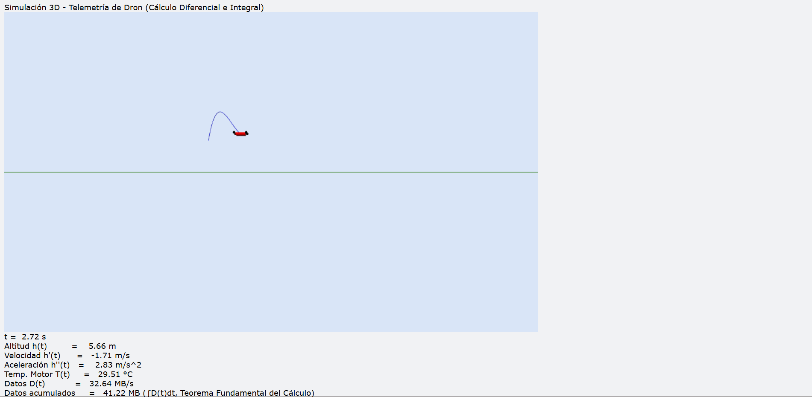
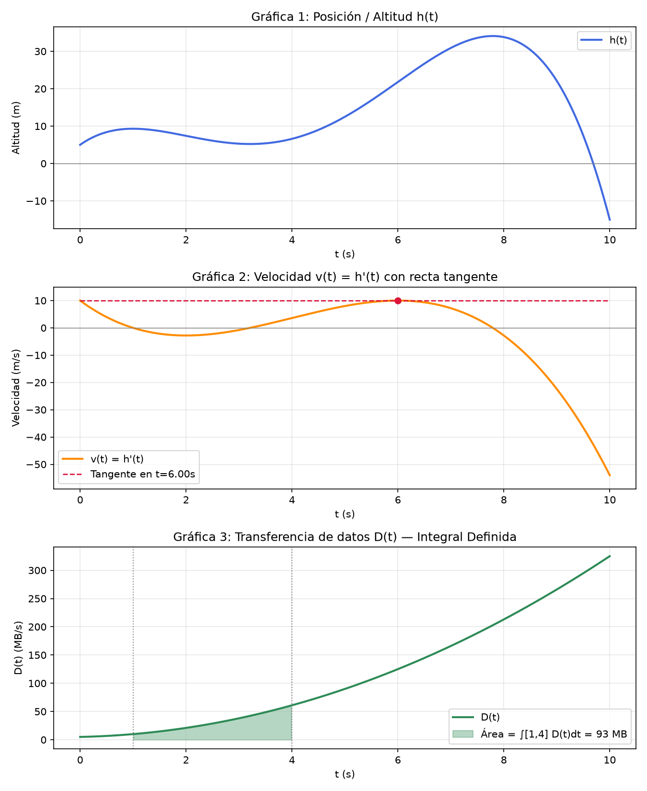
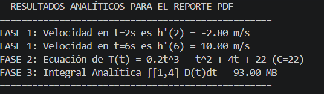

# Simulación 3D y Telemetría Analítica de un Dron de Entregas

**Trabajo Autónomo — Tercer Bimestre · Matemática Aplicada**
Carrera de Desarrollo de Software — Instituto Tecnológico Superior Cordillera
Docente: Ing. Andrés Cangui H. · Período: Agosto – Septiembre 2026

---

## Descripción

Motor de simulación 3D desarrollado en Python que modela la trayectoria, la
velocidad instantánea, la optimización de vuelo y la acumulación total de datos
de un dron de entregas, aplicando Cálculo Diferencial e Integral (derivadas,
puntos críticos, antiderivadas y el Teorema Fundamental del Cálculo) a la
lectura de telemetría en tiempo real.

## Objetivo

Desarrollar un motor de simulación 3D en Python que modele:
- La trayectoria del dron en el espacio (x, y, z).
- La velocidad de cambio instantánea (derivadas) de su altitud.
- La optimización de vuelo (máximos y mínimos de altitud).
- La acumulación total de datos transferidos (integral definida),
  aplicando el Teorema Fundamental del Cálculo.

## Modelos matemáticos

| Fase | Magnitud | Función |
|------|-----------|---------|
| 1 | Altitud | `h(t) = -0.1t⁴ + 1.6t³ - 7.2t² + 10t + 5` |
| 1 | Velocidad vertical (derivada) | `v(t) = h'(t) = -0.4t³ + 4.8t² - 14.4t + 10` |
| 2 | Tasa de calentamiento del motor | `T'(t) = 0.6t² - 2t + 4` |
| 2 | Temperatura reconstruida | `T(t) = 0.2t³ - t² + 4t + 22` |
| 3 | Transferencia de datos (cámara 4K) | `D(t) = 3t² + 2t + 5` |
| 3 | Datos acumulados entre t=1 y t=4 | `∫₁⁴ D(t) dt = F(4) - F(1) = 93 MB` |

El desarrollo analítico completo (derivadas, puntos críticos, criterio de la
segunda derivada, antiderivadas, constante de integración y la integral
definida paso a paso) está documentado en
[`Resolucion_Analitica_Dron.pdf`](./Resolucion_Analitica_Dron.pdf).

## Simulación 3D

El script [`dron_simulation3d.py`](./dron_simulation3d.py) usa VPython para
renderizar un dron (cuerpo + 4 rotores) que se desplaza en 3D siguiendo
`h(t)` como coordenada vertical, dejando una estela de trayectoria y un
vector que representa la velocidad instantánea `h'(t)`.

Durante la simulación se despliega un HUD de telemetría en tiempo real con:
- Altitud actual `h(t)`
- Velocidad instantánea `h'(t)`
- Aceleración `h''(t)`
- Tasa de transferencia `D(t)` y datos acumulados (integral definida
  calculada dinámicamente mediante la regla del trapecio, que converge al
  valor analítico de la Fase 3).

Al finalizar los 10 segundos de vuelo se abre una figura de Matplotlib
con 3 subgráficas:

1. Posición/Altitud `h(t)`
2. Velocidad `v(t) = h'(t)` con la recta tangente en su punto máximo
3. Transferencia de datos `D(t)` con el área bajo la curva sombreada
   entre `t = 1` y `t = 4` (93 MB)

## Capturas de la simulación

Vista 3D en ejecución — dron, estela de trayectoria y HUD de telemetría en tiempo real:



Gráficas de resumen generadas automáticamente al terminar el vuelo:



Verificación en consola — los resultados que imprime el script al terminar
coinciden exactamente con los del documento de resolución analítica:



## Requisitos e instalación

```bash
python3 -m pip install vpython numpy matplotlib
```

## Ejecución

```bash
python3 dron_simulation3d.py
```

La simulación 3D se abre en el navegador (VPython usa un visor web local).
Al cerrar los 10 segundos de vuelo, la ventana de Matplotlib con las 3
gráficas de resumen se abre automáticamente y se guarda como
`resumen_telemetria.png`.

## Estructura del repositorio

```
├── dron_simulation3d.py          # Script principal de simulación 3D + telemetría
├── Resolucion_Analitica_Dron.pdf # Desarrollo matemático completo (Fases 1-3)
├── resumen_telemetria.png        # Gráficas generadas al ejecutar la simulación
├── capturas/
│   ├── vista_3d_hud.png          # Captura de la simulación 3D con el HUD
│   └── consola_verificacion.png  # Verificación de resultados en consola
└── README.md
```

## Integrante

- Cristian Ruiz

## Rúbrica de evaluación

| Criterio | Porcentaje |
|----------|------------|
| Rigor matemático y cálculos (Fases 1, 2 y 3) | 30% |
| Simulación 3D en Python operativa (Fase 4) | 35% |
| Telemetría en tiempo real y gráficas de Matplotlib | 20% |
| Repositorio GitHub, documentación y presentación | 15% |
